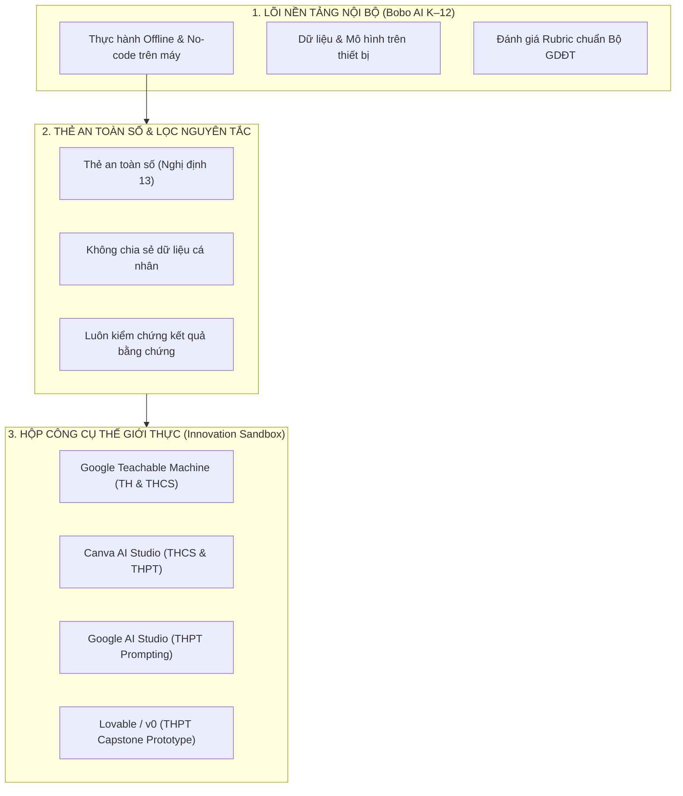

# HƯỚNG DẪN RÀ SOÁT & TÍCH HỢP CÔNG CỤ AI BÊN NGOÀI
## Phục vụ Hoạt động Thực hành, Câu lạc bộ STEM và Dự án Sáng tạo K–12
*Căn cứ Quyết định 2422/QĐ-BGDĐT, Công văn 5588/BGDĐT-GDTrH và Nghị định 13/2023/NĐ-CP về Bảo vệ dữ liệu cá nhân*

---

## 1. Nguyên tắc Pháp lý & Khung Chỉ đạo của Bộ GD&ĐT

Theo **Công văn 5588/BGDĐT-GDTrH (Mục II.2 & IV)** và **Quyết định 2422/QĐ-BGDĐT (Mạch NLb - Đạo đức AI & NLa - Con người là trung tâm)**:
1. **Khuyến khích tiếp cận thế giới thực**: Nhà trường và giáo viên được quyền chủ động lựa chọn, giới thiệu các công cụ AI hiện đại bên ngoài để học sinh trải nghiệm, làm quen và thực hiện các dự án nghiên cứu khoa học kỹ thuật, CLB STEM/AI.
2. **Nguyên tắc "3 Không" bắt buộc**:
   - **Không ép buộc tạo tài khoản cá nhân**: Không bắt buộc học sinh tiểu học hoặc học sinh chưa đủ tuổi quy định phải đăng ký tài khoản cá nhân để được chấm điểm.
   - **Không vi phạm độ tuổi và điều khoản dịch vụ (ToS)**: Phải tuân thủ quy định độ tuổi của từng nền tảng quốc tế (COPPA, GDPR) và Nghị định 13/2023/NĐ-CP của Chính phủ Việt Nam về bảo vệ dữ liệu trẻ em.
   - **Không nạp dữ liệu nhạy cảm**: Tuyệt đối không tải lên họ tên thật, căn cước, số điện thoại, địa chỉ nhà, ảnh khuôn mặt hoặc dữ liệu trường lớp lên các công cụ AI chưa có thỏa thuận bảo mật giáo dục.
3. **Nguyên tắc Bình đẳng Giáo dục**: Nền tảng nội bộ (Bobo AI) luôn là **Lõi bảo đảm tối thiểu** (100% học sinh hoàn thành chuẩn đầu ra dù không có mạng hoặc không có tài khoản). Các công cụ bên ngoài đóng vai trò là **Không gian mở rộng (Innovation Sandbox)**.

---

## 2. Bảng Ma trận Rà soát & Phân tầng 12 Công cụ AI Miễn phí Bên ngoài

| STT | Công cụ | Bản chất & Ứng dụng nổi bật | Yêu cầu Tài khoản & Độ tuổi | Mức độ phù hợp theo cấp học | Chi phí & Giấy phép |
| :---: | :--- | :--- | :--- | :--- | :--- |
| 1 | **Code.org AI for Oceans** *(code.org/oceans)* | Dạy AI phân loại cá và rác đại dương; học về thiên vị dữ liệu (data bias) và đạo đức môi trường | **Không cần tài khoản** Có tiếng Việt 100% |  **Tiểu học (Lớp 3–5)**  **THCS (Lớp 6–7)** | **100% Miễn phí phi lợi nhuận** |
| 2 | **Google AutoDraw** *(autodraw.com)* | Thị giác máy tính nhận diện nét phác thảo và biến thành biểu tượng vẽ hoàn chỉnh | **Không cần tài khoản** Trực tiếp trên web |  **Tiểu học (Lớp 1–5)**  **THCS (Lớp 6–8)** | **100% Miễn phí** |
| 3 | **Google Quick, Draw!** *(quickdraw.withgoogle.com)* | Trò chơi đoán nét vẽ trong 20 giây bằng mạng nơ-ron học sâu toàn cầu | **Không cần tài khoản** Có tiếng Việt |  **Tiểu học (Lớp 1–5)**  **THCS (Lớp 6–8)** | **100% Miễn phí** |
| 4 | **Google Teachable Machine** *(teachablemachine.withgoogle.com)* | Huấn luyện mô hình thị giác (Image), âm thanh (Audio), tư thế (Pose) trên RAM máy tính | **Không cần tài khoản** Webcam chạy cục bộ |  **Tiểu học (Lớp 3–5)**  **THCS (Lớp 6–9)**  **THPT (Lớp 10)** | **100% Miễn phí** |
| 5 | **TensorFlow Playground** *(playground.tensorflow.org)* | Trực quan hóa mạng nơ-ron: tùy biến lớp ẩn, nơ-ron, hàm kích hoạt (ReLU/Sigmoid), learning rate | **Không cần tài khoản** Không thu thập dữ liệu |  **THCS (Lớp 8–9)**  **THPT (Lớp 10–12)** | **100% Miễn phí mã nguồn mở** |
| 6 | **Google Semantris** *(research.google.com/semantris)* | Trò chơi khối chữ ứng dụng mô hình nhúng từ (Word Embeddings) và tìm kiếm ngữ nghĩa NLP | **Không cần tài khoản** Chạy trên trình duyệt |  **THCS (Lớp 7–9)**  **THPT (Lớp 10–11)** | **100% Miễn phí** |
| 7 | **Machine Learning for Kids** *(machinelearningforkids.co.uk)* | Huấn luyện mô hình phân loại và kết nối lập trình khối kéo thả Scratch 3.0 | Tài khoản lớp do GV tạo ẩn danh (không cần email HS) |  **Tiểu học (Lớp 4–5)**  **THCS (Lớp 6–8)** | **100% Miễn phí giáo dục** |
| 8 | **Canva AI (Magic Studio)** *(canva.com)* | Sinh ảnh (Magic Media), viết nội dung (Magic Write), tạo slide thuyết trình, poster truyền thông | Cần tài khoản · **13+** (Canva for Education miễn phí 100%) |  **THCS (Lớp 7–9)**  **THPT (Lớp 10–12)** | **Miễn phí 100% cho giáo dục** |
| 9 | **Google AI Studio** *(aistudio.google.com)* | Sân chơi thử nghiệm Gemini: System Prompt, Temperature, Few-shot, RAG, kiểm tra ảo giác | Cần Google Account · **18+** (hoặc qua Google Workspace trường) |  **THPT (Lớp 10–12)**  **CLB STEM/AI** | **Miễn phí Free Tier hào phóng** |
| 10 | **Lovable (lovable.dev)** | Vibe Coding: Chuyển Project Canvas thành Web App hoàn chỉnh chạy thật qua câu lệnh tự nhiên | Cần GitHub/Google · Không cần thẻ tín dụng |  **THPT (Lớp 12)**  **Dự án Capstone** | **Gói Free Tier hàng tháng** |
| 11 | **v0 by Vercel** *(v0.dev)* | Generative UI: Tạo component giao diện người dùng React và web app hiện đại từ câu lệnh ngắn | Cần GitHub Account · **13+** |  **THPT (Lớp 11–12)**  **Thiết kế Web AI** | **Gói Free Tier miễn phí** |
| 12 | **Hugging Face Spaces & Colab** | Chạy demo hàng ngàn mô hình AI nguồn mở (Spaces) hoặc lập trình Python trên GPU T4 (Colab) | Spaces mở trực tiếp; Colab cần tài khoản Google |  **THPT (Lớp 11–12)**  **Chuyên Tin / KHKT** | **100% Miễn phí GPU T4 / Demo** |

---

## 3. Kiến trúc Cầu nối: "Từ Bobo AI Lab ra Thế giới Thực"

Bobo AI K–12 không đóng kín học sinh trong không gian mô phỏng, mà xây dựng cơ chế **Cầu nối có hướng dẫn (Guided Bridge)**:

---

## 4. Kịch bản Nhiệm vụ Thực hành Gợi ý cho Giáo viên

### A. Nhiệm vụ 1: "Sáng tạo Poster Đạo đức AI" (Cấp THCS — với Canva AI)
- **Bài học kết nối**: Tiết 12 THCS — *Thiết kế AI có trách nhiệm*.
- **Nhiệm vụ**: Học sinh dùng tính năng **Magic Media** trên Canva để vẽ tranh cổ động thông điệp: *"AI là bạn đồng hành, con người giữ trách nhiệm"*.
- **Thực hành đạo đức**: Học sinh tự so sánh: Tranh do AI vẽ có phong cách giống nghệ sĩ nào? Cần ghi nguồn trích dẫn ra sao?

### B. Nhiệm vụ 2: "Thử tài Tinh chỉnh System Prompt" (Cấp THPT — với Google AI Studio)
- **Bài học kết nối**: Tiết 7–8 THPT Lớp 11 — *Prompt Engineering & Tùy biến hành vi AI*.
- **Nhiệm vụ**: Học sinh truy cập [Google AI Studio](https://aistudio.google.com/), chọn mô hình Gemini Flash. 
- **Thử thách**: Điền vào ô **System Instructions**:
  > *"Bạn là chuyên gia nông nghiệp Việt Nam. Chỉ trả lời các câu hỏi về phòng trừ sâu bệnh bằng biện pháp sinh học an toàn. Nếu người dùng hỏi chủ đề ngoài nông nghiệp, hãy từ chối lịch sự."*
- **Kiểm thử**: Đặt các câu hỏi bẫy (jailbreak) để xem AI có giữ vững nguyên tắc đã đặt hay không.

### C. Nhiệm vụ 3: "Biến Ý tưởng Capstone thành Web App trong 5 phút" (Cấp THPT — với Lovable.dev)
- **Bài học kết nối**: Tiết 11–12 THPT Lớp 12 — *Bảo vệ Dự án AI Capstone*.
- **Nhiệm vụ**: Sau khi hoàn thành bảng **Project Canvas** trong Bobo AI, học sinh sao chép bản tóm tắt mục tiêu và dán vào [Lovable](https://lovable.dev/):
  > *"Tạo ứng dụng web 'Trợ lý phân loại rác thông minh': Có giao diện chụp ảnh đồ vật, ô tìm kiếm tên rác, gợi ý thùng rác tái chế hay hữu cơ, và một mini-quiz 3 câu hỏi cho học sinh."*
- **Sản phẩm thu được**: Một Web App chạy thật trên trình duyệt có liên kết trực tiếp để chiếu demo cho cả lớp cùng xem.

---

## 5. Quy tắc An toàn số 4 Lớp dành cho Học sinh

Mỗi khi mở liên kết sang công cụ bên ngoài, giáo viên và học sinh cần ghi nhớ **Quy tắc 4 Lớp**:
1. **Lớp 1 — Ẩn danh tuyệt đối**: Không dùng email cá nhân chứa họ tên đầy đủ nếu dịch vụ không yêu cầu; tuyệt đối không nhập số điện thoại gia đình.
2. **Lớp 2 — Không nạp ảnh nhận dạng**: Với công cụ tạo ảnh, không tải ảnh mặt của bản thân, bạn bè hoặc thầy cô để ghép mặt.
3. **Lớp 3 — Giả định AI luôn có thể bịa đặt (Hallucination)**: Mọi thông tin do AI Studio, ChatGPT hay Canva Write tạo ra đều phải kiểm chứng lại bằng sách giáo khoa, từ điển hoặc văn bản chính thức.
4. **Lớp 4 — Minh bạch bản quyền (Transparency)**: Khi nộp sản phẩm, học sinh phải ghi chú rõ: *"Sản phẩm có sự hỗ trợ của công cụ AI [Tên công cụ] ở khâu [Lên ý tưởng / Vẽ phác thảo / Tạo khung code]"*.
