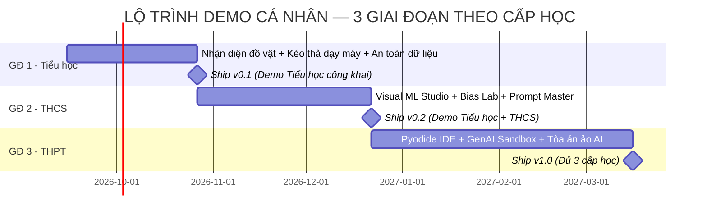

# KẾ HOẠCH TỔNG THỂ PHÁT TRIỂN NỀN TẢNG WEB HỖ TRỢ GIÁO DỤC AI CHO HỌC SINH PHỔ THÔNG (K-12)

> **Căn cứ pháp lý & Chuẩn sư phạm:**
> - Quyết định số 2422/QĐ-BGDĐT ngày 18/8/2026 của Bộ GD&ĐT ban hành Khung nội dung giáo dục trí tuệ nhân tạo cho học sinh phổ thông.
> - Công văn số 5588/BGDĐT-GDPT ngày 19/8/2026 của Bộ GD&ĐT về Hướng dẫn triển khai thực hiện từ năm học 2026-2027.
> - Tài liệu hướng dẫn thí điểm nội dung giáo dục AI cấp Tiểu học, THCS và THPT của Bộ GD&ĐT (2026).
> - Luật Trí tuệ nhân tạo số 134/2025/QH15 và Luật Bảo vệ dữ liệu cá nhân số 91/2025/QH15.

---

## MỤC LỤC
1. [Đánh giá tính khả thi (Feasibility Study)](#1-đánh-giá-tính-khả-thi-feasibility-study)
   - 1.1. Khả thi về Pháp lý & Thời điểm chính sách
   - 1.2. Khả thi về Sư phạm & Năng lực tiếp nhận
   - 1.3. Khả thi về Kỹ thuật & Hạ tầng
   - 1.4. Khả thi về Kinh tế & Vận hành
   - 1.5. Bảng ma trận SWOT
   - 1.6. Nghịch lý "12 tiết/lớp/năm học" & Chiến lược Phễu Nội dung 3 tầng
2. [Tầm nhìn, sứ mệnh và triết lý thiết kế](#2-tầm-nhìn-sứ-mệnh-và-triết-lý-thiết-kế)
3. [Kiến trúc kỹ thuật & Công nghệ nền tảng Web (Web Platform Architecture)](#3-kiến-trúc-kỹ-thuật-tổng-thể-system-architecture)
   - 3.1. Tổng quan phân tầng công nghệ (Full-Stack Technology Stack)
   - 3.2. Kỹ thuật Client-Side Edge AI & WebAssembly (WASM)
   - 3.3. Kỹ thuật Xử lý Media thời gian thực (Vision & Audio Pipeline)
   - 3.4. Kỹ thuật Phòng học Thời gian thực (Real-Time Classroom & State Sync)
   - 3.5. Kiến trúc AI Gateway, Guardrails & LLM Routing
   - 3.6. Chiến lược Ngoại tuyến (PWA) & Tối ưu hóa mạng trường học yếu
   - 3.7. Kiến trúc Triển khai, DevOps & Khả năng Tự Host (On-Premises)
   - 3.8. Kiến trúc 100% Không Cần Backend Truyền Thống (Cloudflare-Native Serverless)
4. [Kế hoạch chi tiết phân hệ Cấp Tiểu học (Lớp 1 - 5)](#4-kế-hoạch-chi-tiết-phân-hệ-cấp-tiểu-học-lớp-1---5)
5. [Kế hoạch chi tiết phân hệ Cấp THCS (Lớp 6 - 9)](#5-kế-hoạch-chi-tiết-phân-hệ-cấp-thcs-lớp-6---9)
6. [Kế hoạch chi tiết phân hệ Cấp THPT (Lớp 10 - 12)](#6-kế-hoạch-chi-tiết-phân-hệ-cấp-thpt-lớp-10---12)
7. [Phân hệ dành cho Giáo viên & Quản trị nhà trường](#7-phân-hệ-dành-cho-giáo-viên--quản-trị-nhà-trường)
8. [Chính sách an toàn, bảo mật dữ liệu học sinh (Privacy by Design)](#8-chính-sách-an-toàn-bảo-mật-dữ-liệu-học-sinh-privacy-by-design)
9. [Lộ trình triển khai (Roadmap) & Kế hoạch nguồn lực](#9-lộ-trình-triển-khai-roadmap--kế-hoạch-nguồn-lực)
10. [Kết luận & Khuyến nghị](#10-kết-luận--khuyến-nghị)

---

## 1. ĐÁNH GIÁ TÍNH KHẢ THI (FEASIBILITY STUDY)

### 1.1. Khả thi về Pháp lý & Thời điểm chính sách (Policy Window) — **ĐÁNH GIÁ: CỰC KỲ KHẢ THI (10/10)**
- **Điểm rơi chính sách vàng:** Bộ Giáo dục và Đào tạo vừa ban hành **Quyết định số 2422/QĐ-BGDĐT** (18/8/2026) và **Công văn số 5588/BGDĐT-GDPT** (19/8/2026) yêu cầu **100% các cơ sở giáo dục phổ thông triển khai 12 tiết/lớp/năm học nội dung cốt lõi từ năm học 2026-2027**.
- **Khoảng trống thị trường lớn:** Đa số các trường phổ thông hiện nay thiếu học liệu thực hành, phòng lab thiếu máy tính cấu hình mạnh có GPU rời, giáo viên Tin học chưa được đào tạo chuyên sâu về AI. Một nền tảng Web chạy trực tiếp trên trình duyệt, không cần cài đặt, bám sát từng tiết học của Bộ sẽ giải quyết đúng "nỗi đau" (pain point) cấp bách của ngành giáo dục.
- **Tuân thủ đúng định hướng:** Bộ khuyến khích các nền tảng mở, trực quan, hỗ trợ giáo dục công bằng, không thu phí ép buộc học sinh. Nền tảng được xây dựng đúng theo tinh thần này sẽ dễ dàng được các Sở/Phòng GD&ĐT đón nhận và giới thiệu thí điểm.

### 1.2. Khả thi về Sư phạm & Năng lực tiếp nhận — **ĐÁNH GIÁ: KHẢ THI CAO (9/10)**
- **Phù hợp phân tầng nhận thức:** Thay vì gộp chung, kế hoạch chia làm 3 phân hệ độc lập phù hợp với tâm sinh lý lứa tuổi:
  - *Tiểu học:* Trực quan hóa 100%, game hóa (gamification), không dòng lệnh, tương tác nghe - nhìn.
  - *THCS:* Kéo thả trực quan (no-code), học máy qua ví dụ (Teachable Machine style), thực hành tư duy phản biện và liêm chính.
  - *THPT:* Lập trình thực chiến (Python in-browser), phân tích dữ liệu, ứng dụng AI tạo sinh có giàn giáo (scaffolding prompts), dự án liên môn định hướng nghề nghiệp.
- **Khớp chuẩn 4 miền năng lực:** Bám sát 100% yêu cầu cần đạt của 4 miền: **NLa** (Lấy con người làm trung tâm), **NLb** (Đạo đức AI & an toàn số), **NLc** (Kỹ thuật & ứng dụng), **NLd** (Thiết kế hệ thống).

### 1.3. Khả thi về Kỹ thuật & Hạ tầng — **ĐÁNH GIÁ: HOÀN TOÀN KHẢ THI (9.5/10)**
- **Thách thức:** Nếu chạy mô hình AI trên server đám mây (Cloud GPU), chi phí vận hành cho hàng trăm ngàn học sinh cùng lúc sẽ cực kỳ đắt đỏ và dễ tắc nghẽn.
- **Giải pháp công nghệ đột phá (Client-side Edge AI):**
  - Sử dụng **TensorFlow.js**, **ONNX Runtime Web**, **MediaPipe Web** và **WebAssembly (WASM)**. Toàn bộ quá trình suy luận (Inference), huấn luyện mô hình phân loại ảnh/âm thanh nhỏ chạy **100% trong bộ nhớ RAM trình duyệt của máy học sinh**.
  - Không cần máy chủ GPU đắt tiền. Máy tính phòng lab cũ của trường (chạy chip Core i3/i5 đời cũ, không card rời) hoặc máy tính bảng của học sinh đều chạy mượt mà ở tốc độ 30-60 FPS.
  - Học sinh THPT chạy mã Python, Pandas, Scikit-learn trực tiếp trên trình duyệt thông qua **Pyodide (WebAssembly)**, không cần máy chủ backend chạy code, bảo mật tuyệt đối.

### 1.4. Khả thi về Kinh tế & Vận hành — **ĐÁNH GIÁ: KHẢ THI (8.5/10)**
- Do 80-90% tải tính toán thực hiện ở Client-side (Edge AI), chi phí server lưu trữ web và database là rất nhỏ (có thể chạy trên VPS tiêu chuẩn hoặc CDN Cloudflare).
- Chi phí chỉ phát sinh khi gọi LLM API (AI tạo sinh) cho học sinh THPT: giải quyết bằng cách áp dụng hạn mức Token/lượt hỏi (Rate limit), tích hợp các mô hình mã nguồn mở tối ưu (Llama 3 / Gemma 2 qua self-host hoặc API giá rẻ) hoặc cho phép nhà trường tự cấu hình API Key.

### 1.5. Bảng ma trận SWOT

| Điểm mạnh (Strengths) | Điểm yếu (Weaknesses) |
| :--- | :--- |
| • Bám sát 100% văn bản chính thức của Bộ GD&ĐT (2422 & 5588).<br>• Kiến trúc Edge AI không tốn server, trường nghèo vẫn dùng được.<br>• Phân hóa 3 cấp học rõ rệt, UX/UI thiết kế may đo từng lứa tuổi.<br>• Chạy trên web, không cần cài đặt phần mềm phức tạp. | • Đội ngũ phát triển cần am hiểu sâu cả kỹ thuật Web/AI lẫn phương pháp sư phạm phổ thông.<br>• Cần kiểm duyệt chặt chẽ nội dung tạo sinh (GenAI) tránh phát ngôn lệch chuẩn với học sinh. |
| **Cơ hội (Opportunities)** | **Thách thức (Threats)** |
| • Năm học 2026-2027 là thời điểm bùng nổ nhu cầu giáo dục AI.<br>• Cơ hội hợp tác với các Sở GD&ĐT, trường quốc tế, trường tư thục và các trung tâm STEM.<br>• Tiềm năng mở rộng cung cấp khóa đào tạo và học liệu cho giáo viên. | • Thiết bị phòng máy tại một số trường vùng sâu vùng xa quá cũ hoặc không có kết nối Internet ổn định (cần hỗ trợ PWA offline).<br>• Cạnh tranh từ các nền tảng nước ngoài (nhưng các nền tảng này không bám sát chương trình Việt Nam). |

### 1.6. Nghịch lý "12 tiết/lớp/năm học" — Ít hay Nhiều? Và Chiến lược Phễu Nội dung 3 tầng

Nhiều người khi mới đọc văn bản thường băn khoăn: *"Mỗi lớp chỉ có 12 tiết/năm học thì có quá ít không? Làm cả một website liệu có bị lãng phí?"* 

Thực tế, nhìn nhận dưới góc độ quản lý nhà nước và chiến lược phát triển sản phẩm công nghệ giáo dục (EdTech), con số 12 tiết là một **thiết kế sư phạm và chính sách vô cùng chuẩn xác**, đồng thời là **cơ hội vàng cho nền tảng web**:

#### A. Tại sao Bộ GD&ĐT lại quy định 12 tiết/lớp/năm học?
1. **Không làm vỡ khung chương trình GDPT 2018:** Thời khóa biểu chính khóa hiện nay của học sinh đã kín (môn Tin học chỉ có 35 tiết/năm ở Tiểu học & THCS, 70 tiết/năm ở THPT). Nếu Bộ ép đưa thêm 35 hay 70 tiết AI vào chính khóa sẽ gây quá tải nặng nề, thiếu biên chế giáo viên và vỡ thời khóa biểu.
2. **Khả thi triển khai đồng loạt 63 tỉnh thành:** 12 tiết là thời lượng vừa vặn nhất để xếp vào kế hoạch dạy học 2 buổi/ngày (theo Chỉ thị 17/CT-TTg) mà mọi trường học, từ trường chuyên thành phố lớn đến trường vùng sâu vùng xa, đều có thể hoàn thành trọn vẹn mà không bị "cháy giáo án".
3. **Quy mô tích lũy xuyên suốt 12 năm:** Hãy làm phép tính: $12 \text{ lớp} \times 12 \text{ tiết} = \mathbf{144 \text{ tiết học}}$ chuyên đề AI từ lớp 1 đến lớp 12! Đây là một lộ trình dài hạn, xoắn ốc (spiral curriculum) cực kỳ đồ sộ, đưa Việt Nam vào nhóm số ít quốc gia trên thế giới phổ cập AI liên tục suốt 12 năm học.

#### B. Chiến lược "Phễu Nội dung 3 tầng" cho Nền tảng Web
Nếu website chỉ làm vỏn vẹn 12 tiết rồi dừng lại, học sinh học xong sẽ rời đi. Do đó, nền tảng phải được định vị theo mô hình **3 Tầng giá trị**:

```
                       CHIẾN LƯỢC NỀN TẢNG: PHỄU NỘI DUNG 3 TẦNG

          ▲       ┌─────────────────────────────────────────────────────────┐
         / \      │ TẦNG 3: AI HỖ TRỢ HỌC TẬP LIÊN MÔN HÀNG NGÀY (DAILY USE)│
        /   \     │ • Trợ lý AI học Văn, Sử, Anh, Toán, Khoa học tự nhiên    │
       / T3  \    │ • Hỏi đáp gia sư AI 24/7, tóm tắt bài giảng, làm quiz   │
      /───────\   ├─────────────────────────────────────────────────────────┤
     /   T2    \  │ TẦNG 2: NỘI DUNG MỞ RỘNG & DỰ ÁN CLB STEM (RETENTION)   │
    /           \ │ • Hàng trăm dự án nâng cao, thi KHKT, Robotics, Hackathon│
   /─────────────\├─────────────────────────────────────────────────────────┤
  /      T1       \ TẦNG 1: 12 TIẾT CỐT LÕI BẮT BUỘC THEO BỘ GD&ĐT (THE HOOK)│
 /                 \ • Chuẩn đầu ra Khung 2422, Giáo án cho giáo viên trên lớp│
└───────────────────┴─────────────────────────────────────────────────────────┘
```

- **Tầng 1 - Cốt lõi bắt buộc (The Hook):** Cung cấp chuẩn xác 12 bài học mẫu tương ứng 12 tiết của Bộ. Đây là "mồi câu" (hook) giúp nền tảng tiếp cận trực tiếp các trường học và giáo viên. Giáo viên BẮT BUỘC phải dùng nền tảng để hoàn thành nhiệm vụ chỉ tiêu năm học.
- **Tầng 2 - Nội dung mở rộng & Câu lạc bộ (Retention & Upsell):** Công văn 5588 nêu rõ: Nhà trường được chủ động tổ chức *Nội dung mở rộng* không giới hạn thời lượng thông qua CLB Tin học/AI, hoạt động STEM, ngoại khóa. Nền tảng cung cấp kho 100+ dự án chuyên sâu (xe tự hành, nhận diện cử chỉ điều khiển game, chatbot trường học...) để học sinh thực hành quanh năm.
- **Tầng 3 - Công cụ hỗ trợ học tập liên môn hàng ngày (Everyday Utility):** Biến nền tảng thành "Người bạn đồng hành học tập" (AI Learning Companion) cho mọi môn học: AI phân tích tác phẩm Văn học, AI luyện phát âm Tiếng Anh, AI mô phỏng thí nghiệm Vật lý - Hóa học. Học sinh vào website hàng ngày để học bài, chứ không chỉ chờ đến tiết học AI.

---

## 2. TẦM NHÌN, SỨ MỆNH VÀ TRIẾT LÝ THIẾT KẾ

### 2.1. Tầm nhìn
Trở thành **Hệ sinh thái số số 1 tại Việt Nam** đồng hành cùng nhà trường, giáo viên và học sinh phổ thông trong việc thực hiện thắng lợi Chương trình giáo dục AI K-12 Quốc gia.

### 2.2. Ba nguyên lý thiết kế cốt lõi
1. **Human-Centred by Design (Công nghệ vì con người):** Mọi module bài học đều phải làm nổi bật vai trò làm chủ của học sinh: AI là công cụ trợ giúp, con người ra quyết định, kiểm chứng và chịu trách nhiệm.
2. **Zero Barrier (Không rào cản tiếp cận):** Mở trình duyệt là học được ngay; giao diện tiếng Việt trong sáng; hỗ trợ chạy offline khi mạng chập chờn; không ép học sinh đăng ký thông tin cá nhân nhạy cảm.
3. **Traceable & Ethical (Minh bạch & Đạo đức):** Luôn có nhãn phân biệt nội dung do AI tạo ra (AI-generated badge); tích hợp bài tập kiểm tra tính thiên vị (bias) và kiểm chứng sự thật (fact-checking).

---

## 3. KIẾN TRÚC KỸ THUẬT TỔNG THỂ (SYSTEM ARCHITECTURE)

```
┌──────────────────────────────────────────────────────────────────────────────────┐
│                             GIAO DIỆN NGƯỜI DÙNG (FRONTEND)                      │
│       [Tiểu học: Game & Trực quan]   [THCS: Visual ML Studio]   [THPT: Python Web IDE]   │
└─────────────────────────┬────────────────────────────┬───────────────────────────┘
                          │                            │
                          ▼                            ▼
      ┌──────────────────────────────────────┐   ┌────────────────────────────────┐
      │     CLIENT-SIDE AI ENGINES (EDGE)    │   │  SECURE BACKEND / API GATEWAY  │
      │  (Chạy 100% trên trình duyệt học sinh)│   │  (Chỉ xử lý tài khoản, dữ liệu)│
      ├──────────────────────────────────────┤   ├────────────────────────────────┤
      │ • TensorFlow.js / ONNX Runtime Web   │   │ • Node.js / FastAPI Service    │
      │ • MediaPipe (Face/Hand/Pose Tracking)│   │ • PostgreSQL / SQLite Database │
      │ • Pyodide (In-browser Python + ML)   │   │ • AI Safety Guardrails & Filter│
      │ • Web Speech API (Giọng nói Tiếng Việt)│ │ • Prompt Sanitizer & Rate Limit│
      │ • Local Storage / IndexedDB (Dự án)  │   │ • LLM Routing (Gemini/Gemma)   │
      └──────────────────────────────────────┘   └────────────────────────────────┘
```

### 3.1. Tổng quan phân tầng công nghệ (Full-Stack Technology Stack)

| Tầng kiến trúc (Layer) | Công nghệ đề xuất | Vai trò & Lý do lựa chọn kỹ thuật |
| :--- | :--- | :--- |
| **Frontend Framework** | **Next.js 15+ (App Router)** hoặc **Vite + React 19** | Hỗ trợ Server-Side Rendering (SSR) cho SEO/tài liệu, Static Site Generation (SSG) cho tốc độ tải trang tức thì, và Single Page Application (SPA) cho các phòng lab thực hành tương tác cao. |
| **UI Design System** | **Tailwind CSS v4 + Radix UI + Framer Motion** | Thiết kế giao diện Glassmorphism hiện đại, tuân thủ chuẩn tương phản tiếp cận WCAG 2.1 AA cho học sinh; animation mượt mà 60fps; hỗ trợ Light/Dark/High-Contrast Mode. |
| **Edge AI Engine (Client)** | **TensorFlow.js**, **ONNX Runtime Web**, **MediaPipe** | Chạy mô hình học máy trực tiếp trên trình duyệt của học sinh; tận dụng WebGPU và WebGL; **0đ chi phí máy chủ GPU**. |
| **Python Web Sandbox** | **Pyodide (Python 3.12 via WebAssembly)** | Thực thi mã nguồn Python, `pandas`, `scikit-learn`, `numpy`, `matplotlib` hoàn toàn trong luồng Web Worker của trình duyệt; không cần máy chủ backend chạy code. |
| **Realtime Engine** | **Socket.io / WebSockets & Server-Sent Events (SSE)** | Đồng bộ trạng thái lớp học thời gian thực: giáo viên phát mã PIN, chia sẻ màn hình bài mẫu, quan sát tiến độ thực hành của học sinh theo thời gian thực. |
| **Backend & API Gateway** | **FastAPI (Python)** hoặc **NestJS / Fastify (Node.js)** | Hiệu năng cao, xử lý API Gateway, xác thực người dùng, tích hợp Guardrails kiểm duyệt câu hỏi, định tuyến gọi LLM và ghi log kiểm toán. |
| **Database & Cache** | **PostgreSQL (với Supabase/Prisma)** + **Redis** | Lưu trữ cấu trúc khóa học, kết quả đánh giá năng lực, quản lý phiên phòng học tạm thời; Redis xử lý Rate Limiting và Token Bucket. |
| **Offline & Caching** | **PWA (Service Workers + Workbox) + IndexedDB** | Tải trước và lưu trữ cục bộ các tệp trọng số mô hình (weights) dung lượng 20-50MB; hỗ trợ học sinh thực hành hoàn toàn khi mất kết nối Internet. |

---

### 3.2. Kỹ thuật Client-Side Edge AI & WebAssembly (Mấu chốt kỹ thuật không tốn server)

Điểm đột phá kỹ thuật lớn nhất của nền tảng là **chuyển 90% tải tính toán AI về thiết bị của người dùng (Client-Side Edge Computing)**. Kỹ thuật này giải quyết triệt để bài toán chi phí hạ tầng và bảo mật dữ liệu học sinh:

```
                          KIẾN TRÚC CLIENT-SIDE EDGE AI
┌─────────────────────────────────────────────────────────────────────────────┐
│                           TRÌNH DUYỆT CỦA HỌC SINH                          │
│                                                                             │
│  ┌───────────────────────────────┐     postMessage     ┌─────────────────┐  │
│  │       UI MAIN THREAD          │ ◄─────────────────► │  DEDICATED      │  │
│  │ • Giao diện React / DOM       │    (Không lag UI)   │  WEB WORKER     │  │
│  │ • Render Canvas / Video Feed  │                     │ • Pyodide (WASM)│  │
│  │ • Biểu đồ kết quả (Chart.js)  │                     │ • TF.js Engine  │  │
│  └───────────────┬───────────────┘                     └────────┬────────┘  │
│                  │                                              │           │
│                  ▼                                              ▼           │
│  ┌───────────────────────────────┐                     ┌─────────────────┐  │
│  │ TĂNG TỐC ĐỒ HỌA PHẦN CỨNG     │                     │ INDEXEDDB &     │  │
│  │ • WebGPU (Mới nhất, siêu tốc) │                     │ CACHE STORAGE   │  │
│  │ • WebGL 2.0 (Tương thích cao) │                     │ Lưu trữ Offline │  │
│  │ • WASM SIMD (Đa luồng CPU)    │                     │ Mô hình 20-50MB │  │
│  └───────────────────────────────┘                     └─────────────────┘  │
└─────────────────────────────────────────────────────────────────────────────┘
```

#### A. Kiến trúc tách luồng tính toán (Off-Main-Thread Architecture) qua Web Workers
- **Vấn đề:** Việc nạp mô hình AI hoặc huấn luyện học máy (Training loop) ngốn rất nhiều CPU/GPU. Nếu chạy trên luồng chính (Main Thread), giao diện trình duyệt sẽ bị "đơ" (freeze), giật lag, gây ức chế cho học sinh.
- **Giải pháp:** Toàn bộ tác vụ tính toán nặng được đóng gói chạy trong **Dedicated Web Workers**:
  - *Luồng chính (Main Thread):* Chỉ phụ trách nhận luồng hình ảnh từ Webcam, vẽ khung nhận diện lên HTML5 Canvas ở tần số 60 FPS và phản hồi tương tác nút bấm.
  - *Luồng ngầm (Web Worker):* Chạy `Pyodide` hoặc `TensorFlow.js`, nhận dữ liệu điểm ảnh qua cơ chế `transferable objects` (ArrayBuffer không tốn chi phí copy bộ nhớ), thực hiện suy luận (Inference) và trả về kết quả nhãn dự đoán.

#### B. Tăng tốc phần cứng đa tầng (Hardware Acceleration Tiers)
Hệ thống tự động phát hiện năng lực phần cứng của máy học sinh để kích hoạt backend tương ứng theo thứ tự ưu tiên:
1. **Tier 1 - WebGPU (`tf.setBackend('webgpu')`):** Dành cho các máy tính hiện đại, cho phép truy cập trực tiếp nhân tính toán đồ họa với độ trễ suy luận cực thấp (<15ms).
2. **Tier 2 - WebGL (`tf.setBackend('webgl')`):** Backend mặc định tương thích với 98% máy tính phòng lab hiện nay (kể cả chip đồ họa tích hợp Intel HD Graphics đời cũ).
3. **Tier 3 - WASM SIMD (`tf.setBackend('wasm')`):** Tận dụng tập lệnh vector SIMD đa luồng của CPU khi máy học sinh bị lỗi driver card đồ họa hoặc tắt WebGL.

#### C. Chiến lược lưu trữ & Cache mô hình thông minh (IndexedDB Model Caching)
- Các tệp trọng số mô hình (`model.json` và các file nhị phân `.bin`) có kích thước từ 15MB đến 45MB. Nếu mỗi tiết học 40 học sinh trong cùng một phòng máy đồng loạt tải mô hình về sẽ gây sập mạng WiFi của trường.
- **Giải pháp:**
  - Sử dụng **Cache Storage API** kết hợp **IndexedDB** (`idb` wrapper).
  - Khi học sinh truy cập lần đầu, hệ thống tải mô hình và lưu vĩnh viễn vào bộ nhớ IndexedDB của trình duyệt.
  - Những lần học tiếp theo, mô hình được nạp thẳng từ ổ cứng cục bộ chỉ trong **0.3 giây**, tiêu tốn **0 KB băng thông Internet**.

#### D. Sandbox Python trong trình duyệt bằng Pyodide WebAssembly (Dành cho THPT)
- **Cơ chế:** Trình thông dịch CPython 3.12 được biên dịch toàn bộ sang WebAssembly (WASM).
- **Ưu thế vượt trội:**
  - Học sinh có thể `import numpy as np`, `import pandas as pd`, `from sklearn.tree import DecisionTreeClassifier` và chạy trực tiếp.
  - Vẽ biểu đồ dữ liệu: Mã Python tạo đồ thị thông qua `matplotlib`, hệ thống tự động xuất ra định dạng Base64 PNG hoặc SVG nhúng trực tiếp lên trang web.
  - **Bảo mật tuyệt đối:** Mã lệnh của học sinh chạy hoàn toàn trong không gian cách ly (Sandbox) của trình duyệt, không thể tấn công hoặc can thiệp vào máy tính của trường học hay máy chủ nền tảng.

---

### 3.3. Kỹ thuật Xử lý Media thời gian thực (Real-time Vision & Audio Pipeline)

```
                            REAL-TIME PERCEPTION PIPELINE
 ┌───────────────┐      ┌─────────────────────────┐      ┌─────────────────────────┐
 │ HTML5 CAMERA  │ ───► │  CANVAS PREPROCESSING   │ ───► │ MEDIAPIPE / TF.JS TASKS │
 │ (getUserMedia)│ 30fps│ (Resize 224x224, BGR)   │      │ (Pose, Hand, Face Mesh) │
 └───────────────┘      └─────────────────────────┘      └────────────┬────────────┘
                                                                      │
 ┌───────────────┐      ┌─────────────────────────┐                   │
 │ MICROPHONE    │ ───► │  AUDIOWORKLET NODE      │ ───► Spectrogram  │
 │ (Web Audio)   │      │ (FFT, Mel-Frequency)    │                   ▼
 └───────────────┘      └─────────────────────────┘      ┌─────────────────────────┐
                                                         │ REAL-TIME VISUALIZATION │
                                                         │ • Khung xương cử chỉ tay│
                                                         │ • Thanh tự tin % nhãn   │
                                                         └─────────────────────────┘
```

#### A. Xử lý thị giác máy tính (Vision Pipeline)
- Sử dụng `@mediapipe/tasks-vision` tối ưu riêng cho Web:
  - **Hand Gesture Recognition:** Nhận diện 21 khớp bàn tay với độ trễ <10ms; phục vụ các dự án điều khiển trò chơi không chạm hoặc nhận diện ngôn ngữ ký hiệu.
  - **Face Landmarker:** Nhận diện 478 điểm lưới trên khuôn mặt (Face Mesh); phục vụ các bài học phát hiện trạng thái ngủ gật, mệt mỏi khi học tập.
  - **Image Classification & Object Detection:** Sử dụng MobileNetV3 và EfficientNet-Lite dung lượng siêu nhẹ (<10MB).

#### B. Xử lý âm thanh & Giọng nói tiếng Việt (Audio & Speech Pipeline)
- **Web Audio API & AudioWorklet:** Thu thập tín hiệu âm thanh từ Microphone theo thời gian thực mà không bị gián đoạn âm thanh (zero audio glitching). Tự động chuyển đổi dạng sóng âm (waveform) sang biểu đồ phổ tần số (Spectrogram) để trực quan hóa khái niệm "Cách máy tính nghe âm thanh".
- **Bộ nhận dạng & Tổng hợp giọng nói tiếng Việt:**
  - Tích hợp chuẩn **Web Speech API (`SpeechRecognition` & `SpeechSynthesis`)** có sẵn trên trình duyệt Chrome/Edge với ngôn ngữ `vi-VN` hoàn toàn miễn phí.
  - Dự phòng (Fallback): Kết nối dịch vụ TTS Tiếng Việt chất lượng cao (như Edge TTS / Piper TTS nội bộ) để đọc lời thoại dẫn dắt cho robot Bo-Bo ở cấp Tiểu học.

---

### 3.4. Kỹ thuật Phòng học Thời gian thực (Real-Time Classroom & State Sync)

Để phục vụ phương thức dạy học trên lớp của giáo viên theo Công văn 5588, hệ thống xây dựng cơ chế tương tác thời gian thực thông qua WebSockets:

```
                            CƠ CHẾ PHÒNG HỌC THỜI GIAN THỰC
   ┌───────────────────────────┐                    ┌───────────────────────────┐
   │    BÀN GIÁO VIÊN (HOST)   │                    │    MÁY HỌC SINH (CLIENT)  │
   │ • Tạo phòng: PIN 6 số     │                    │ • Nhập PIN: 839 201       │
   │ • Đẩy bài mẫu (Broadcast) │ ─── WebSocket ───► │ • Nhận code/dữ liệu mẫu   │
   │ • Khóa màn hình (Freeze)  │     (Socket.io)    │ • Chế độ "Lắng nghe GV"   │
   │ • Dashboard tiến độ lớp   │ ◄─── Heartbeat ─── │ • Báo cáo % hoàn thành    │
   └───────────────────────────┘                    └───────────────────────────┘
```

1. **Kiến trúc phòng học Zero-Login (Mã PIN 6 số):**
   - Giáo viên chỉ cần bấm **"Mở phòng học"** $\rightarrow$ Hệ thống sinh mã PIN ngẫu nhiên (ví dụ: `729-104`) và mã QR.
   - Học sinh mở website, nhập mã PIN và tên thường gọi $\rightarrow$ Tự động kết nối vào phiên học (Session) lưu trên bộ nhớ Redis.
   - **Lợi ích:** Tiết kiệm 15 phút đầu giờ của tiết học (thay vì bắt 40 học sinh nhớ mật khẩu và đăng nhập email).
2. **Tính năng "Khóa màn hình tập trung" (Classroom Focus Mode):**
   - Khi giáo viên cần giảng lý thuyết hoặc hướng dẫn thao tác mẫu, giáo viên bấm "Tập trung".
   - Ngay lập tức, màn hình tất cả máy con sẽ mờ đi và hiển thị thông báo: *"Thầy cô đang giảng bài, các em hãy chú ý lên bảng nhé!"*, vô hiệu hóa tạm thời các nút bấm thực hành.
3. **Giám sát trực tiếp ma trận tiến độ (Live Progress Matrix):**
   - Màn hình giáo viên hiển thị một lưới trực quan 40 ô vuông đại diện cho 40 học sinh.
   - Ô chuyển màu xanh khi học sinh đã nạp xong tập dữ liệu, màu vàng khi đang huấn luyện, màu đỏ khi code Python bị lỗi cú pháp $\rightarrow$ Giáo viên phát hiện ngay học sinh nào đang gặp khó khăn để xuống tận nơi hỗ trợ kịp thời.

---

### 3.5. Kiến trúc AI Gateway, Guardrails & LLM Routing (Phía máy chủ)

Đối với các bài học về AI tạo sinh (GenAI), Prompt Engineering và Chatbot ở cấp THCS & THPT, hệ thống xây dựng một cổng API Gateway thông minh và an toàn:

```
                              AI GATEWAY & GUARDRAILS
 ┌───────────────┐       ┌────────────────────────────────────────────────────────┐
 │ PROMPT HỌC    │ ────► │ 1. PII REDACTION (Xóa SĐT, Email, Tên thật, Địa chỉ)   │
 │ SINH GỬI LÊN  │       ├────────────────────────────────────────────────────────┤
 └───────────────┘       │ 2. CONTENT SAFETY FILTER (Chặn bạo lực, người lớn...)   │
                         ├────────────────────────────────────────────────────────┤
                         │ 3. RATE LIMITING (Token Bucket theo IP trường/Mã lớp) │
                         ├────────────────────────────────────────────────────────┤
                         │ 4. MODEL ROUTER & LOAD BALANCER                        │
                         │    • Mode 1: Gemini 1.5/2.0 Flash (Tốc độ, rẻ)         │
                         │    • Mode 2: Local Gemma 2 / Llama 3 (On-Premises)    │
                         │    • Mode 3: Claude 3.5 Haiku / GPT-4o Mini            │
                         ├────────────────────────────────────────────────────────┤
 ┌───────────────┐       │ 5. OUTPUT SANITIZER & FACT CHECK BADGE                 │
 │ KẾT QUẢ AN    │ ◄──── │ (Gắn nhãn cảnh báo: "Nội dung do AI tạo sinh")         │
 │ TOÀN VỀ TRƯỜNG│       └────────────────────────────────────────────────────────┘
 └───────────────┘
```

1. **Khử định danh dữ liệu cá nhân (PII Sanitization):**
   - Bộ lọc biểu thức chính quy (Regex) và Named Entity Recognition (NER) quét câu hỏi của học sinh trước khi gửi ra Internet.
   - Tự động thay thế: Số điện thoại $\rightarrow$ `[SỐ_ĐIỆN_THOẠI]`, địa chỉ nhà $\rightarrow$ `[ĐỊA_CHỈ]`, ngăn chặn triệt để nguy cơ lộ lọt dữ liệu học sinh ra các mô hình AI thương mại.
2. **Hệ thống phân luồng mô hình thông minh (Model Router):**
   - Ưu tiên sử dụng các mô hình có chi phí cực thấp hoặc miễn phí giáo dục (Gemini 2.0 Flash, Claude 3.5 Haiku).
   - Hỗ trợ kết nối máy chủ cục bộ (On-Premises Ollama/vLLM) đặt tại Sở GD&ĐT hoặc phòng máy của trường để chạy mô hình mã nguồn mở tiếng Việt hoàn toàn nội bộ.
3. **Quản lý hạn mức Token (Token Bucket Quota Management):**
   - Mỗi lớp học được cấp một hạn mức (ví dụ: 100.000 tokens/tiết học).
   - Cơ chế Sliding Window ngăn chặn học sinh spam câu hỏi liên tục làm cạn kiệt kinh phí hoặc gây nghẽn mạng.

---

### 3.6. Chiến lược Ngoại tuyến (PWA) & Tối ưu hóa trên mạng trường học yếu

Hạ tầng mạng tại các trường phổ thông Việt Nam thường đối mặt với tình trạng nghẽn băng thông giờ cao điểm (40 máy tính cùng tải mạng một lúc). Nền tảng áp dụng các tiêu chuẩn kỹ thuật tối ưu hóa mạng khắt khe:

1. **Kiến trúc Progressive Web App (PWA) & Service Workers:**
   - Cài đặt `Workbox` cấu hình chiến lược **Cache-First** đối với toàn bộ tệp tĩnh (HTML, CSS, JS, Fonts, Icons, Âm thanh).
   - Khi đã nạp một lần, website có thể mở và hoạt động bình thường ngay cả khi dây mạng bị rút hoặc WiFi mất kết nối.
2. **Tối ưu hóa dung lượng Bundle (Bundle Size Optimization):**
   - Áp dụng kỹ thuật **Dynamic Import & Route-based Code Splitting**: Phân hệ Tiểu học không bao giờ tải mã thư viện của Pyodide hay Scikit-learn (tiết kiệm ~30MB tải ban đầu).
   - Nén tài nguyên chuẩn **Brotli** mức tối đa trên máy chủ CDN, giúp dung lượng tải mã JavaScript ban đầu của trang chủ chỉ còn **dưới 180 KB**, thời gian tương tác đầu tiên (TTI - Time to Interactive) đạt **dưới 1.2 giây**.
3. **Định dạng hình ảnh & Media tối ưu:**
   - 100% icon sử dụng định dạng vector SVG.
   - Hình ảnh minh họa bài học chuyển đổi sang chuẩn nén thế hệ mới **WebP / AVIF** giảm 70% dung lượng so với PNG/JPEG truyền thống.

---

### 3.7. Kiến trúc Triển khai, DevOps & Khả năng Tự Host (On-Premises)

Nền tảng được đóng gói linh hoạt để có thể vận hành dưới 2 mô hình:

```
                            HAI MÔ HÌNH VẬN HÀNH LINH HOẠT
   ┌────────────────────────────────────────┐  ┌────────────────────────────────────────┐
   │    MÔ HÌNH 1: PUBLIC CLOUD SAAS        │  │   MÔ HÌNH 2: ON-PREMISES LOCAL EDGE    │
   │ (Phục vụ truy cập tự do toàn quốc)     │  │ (Dành cho trường học / Vùng không mạng)│
   ├────────────────────────────────────────┤  ├────────────────────────────────────────┤
   │ • Hosting: Cloudflare Pages / Vercel   │  │ • Đóng gói: 01 Docker Image duy nhất   │
   │ • CDN: Mạng phân phối toàn cầu Edge    │  │ • Cài đặt: 1 máy chủ mini tại trường    │
   │ • Database: Managed PostgreSQL         │  │ • Mạng nội bộ: Học sinh gõ IP nội bộ   │
   │ • Tự động co giãn theo lượng truy cập  │  │   (192.168.1.100:3000) vào học mượt mà │
   └────────────────────────────────────────┘  └────────────────────────────────────────┘
```

- **Mô hình Public Cloud:** Phục vụ hàng triệu học sinh tự học tại nhà và các trường có kết nối Internet tốt. Triển khai CI/CD tự động qua GitHub Actions, kiểm thử tự động (Automated Testing) với Playwright để đảm bảo mọi tính năng nhận diện webcam và chạy code Python không bao giờ bị lỗi khi nâng cấp phiên bản.
- **Mô hình On-Premises (Local Lab Appliance):** Đóng gói toàn bộ nền tảng (bao gồm sẵn các mô hình AI offline) vào một container **Docker** hoặc máy ảo **Proxmox LXC**. Trường học chỉ cần cắm 1 chiếc máy tính mini (Mini PC / Raspberry Pi 5) vào mạng LAN phòng máy là toàn bộ 40 máy tính học sinh đều có thể học tập mượt mà mà **hoàn toàn không cần kết nối ra Internet**.

---

### 3.8. Kiến trúc 100% Không Cần Backend Truyền Thống: "Cloudflare-Native Serverless"

Nếu bạn **không có máy chủ backend riêng (VPS/Dedicated Server)** và chỉ có **Cloudflare Workers**, dự án **HOÀN TOÀN KHẢ THI 100%**, thậm chí đây còn là **kiến trúc tối ưu, hiện đại, bảo mật và tiết kiệm chi phí nhất** cho dự án giáo dục phổ thông này.

Nhờ việc toàn bộ tác vụ AI nặng (thị giác máy tính, huấn luyện mô hình, chạy Python) đã được chuyển về **Client-Side Edge AI (Trình duyệt học sinh)**, bạn không cần một máy chủ backend cồng kềnh để gánh tải. Toàn bộ hệ sinh thái của Cloudflare thay thế hoàn hảo mọi thành phần của backend truyền thống:

```
                  KIẾN TRÚC CLOUDFLARE-NATIVE 100% SERVERLESS
┌────────────────────────────────────────────────────────────────────────────────────────┐
│                              FRONTEND: CLOUDFLARE PAGES                                │
│       • Build tĩnh (Vite + React / Next.js Static Export `output: export`)             │
│       • Phân phối toàn cầu qua Anycast CDN (PoP tại TP.HCM & Hà Nội, độ trễ <10ms)     │
│       • Miễn phí 100% băng thông và lượt request (Zero Egress Fees)                    │
└───────────────────────────────────────────┬────────────────────────────────────────────┘
                                            │ Fetch API / WebSocket
                                            ▼
┌────────────────────────────────────────────────────────────────────────────────────────┐
│                          GATEWAY & LOGIC: CLOUDFLARE WORKERS                           │
│                                                                                        │
│  ┌───────────────────────┐   ┌───────────────────────────┐   ┌──────────────────────┐  │
│  │  LLM PROXY & SAFETY   │   │  CLOUDFLARE WORKERS AI    │   │  DURABLE OBJECTS     │  │
│  │  • Giấu API Key       │   │  • Chạy LLM trực tiếp     │   │  • WebSocket Room    │  │
│  │  • Lọc từ nhạy cảm    │   │    tại Edge Cloudflare    │   │  • Quản lý mã PIN    │  │
│  │  • Khử PII học sinh   │   │  • Llama 3, Gemma 2       │   │  • Đồng bộ GV-HS     │  │
│  └───────────┬───────────┘   └─────────────┬─────────────┘   └──────────┬───────────┘  │
│              │                             │                            │              │
│              ▼                             ▼                            ▼              │
│  ┌───────────────────────┐   ┌───────────────────────────┐   ┌──────────────────────┐  │
│  │ CLOUDFLARE D1         │   │ CLOUDFLARE KV             │   │ CLOUDFLARE R2        │  │
│  │ (Serverless SQLite)   │   │ (Key-Value Storage)       │   │ (Object Storage S3)  │  │
│  │ • Cấu trúc 12 bài học │   │ • Lưu Session PIN 3 giờ   │   │ • Chứa trọng số      │  │
│  │ • Ngân hàng đề, điểm  │   │ • Rate Limit theo IP      │   │   mô hình AI (bin)   │  │
│  └───────────────────────┘   └───────────────────────────┘   └──────────────────────┘  │
└────────────────────────────────────────────────────────────────────────────────────────┘
```

#### Bảng đối chiếu: Backend Truyền Thống vs. Hệ Sinh Thái Cloudflare

| Thành phần hệ thống | Giải pháp Backend Truyền Thống (Tốn kém, phức tạp) | Giải pháp Cloudflare Serverless (Gọn nhẹ, Miễn phí/Cực rẻ) |
| :--- | :--- | :--- |
| **Web Hosting** | Thuê VPS Ubuntu, cấu hình Nginx, gia hạn SSL Certbot | **Cloudflare Pages:** Git push là tự động deploy, SSL tự động, băng thông miễn phí vô tận. |
| **Tính toán AI (Vision/ML)** | Thuê Cloud GPU (Nvidia T4/A10G) đắt đỏ ($500 - $2.000/tháng) | **100% Client-Side:** Chạy trên WebAssembly / WebGPU của máy học sinh, Cloudflare tốn 0đ. |
| **API Gateway & Proxy LLM** | Viết server Node.js / FastAPI, quản trị Docker container | **Cloudflare Worker (1 file JS/TS):** Ẩn Gemini API Key, khử định danh PII, stream kết quả về client. |
| **Chạy Model LLM Ngôn ngữ** | Gọi OpenAI đắt đỏ hoặc dựng server Ollama riêng | **Cloudflare Workers AI:** Chạy sẵn Llama 3, Gemma 2, Mistral ngay tại Edge của Cloudflare; có gói dùng miễn phí hàng ngày! |
| **Cơ sở dữ liệu (Database)** | Cài đặt PostgreSQL, backup định kỳ, lo mở port | **Cloudflare D1:** Serverless SQL (SQLite) phân tán, truy vấn cực nhanh từ Worker, miễn phí 5 triệu lượt đọc/ngày. |
| **Bộ nhớ đệm & Mã PIN lớp** | Cài đặt Redis server, cấu hình RAM | **Cloudflare KV:** Lưu mã PIN phòng học (TTL 3 tiếng tự hủy), đếm lượt gọi để Rate Limit. |
| **Lớp học thời gian thực** | Dựng Socket.io server, lo lắng kết nối treo (Zombie connection) | **Cloudflare Durable Objects:** Quản lý WebSocket theo phòng học, tự động đánh thức khi có kết nối và ngủ khi lớp học kết thúc. |
| **Lưu tệp mô hình & Học liệu** | Thuê AWS S3 (trả phí tải xuống Egress rất đắt) | **Cloudflare R2:** Lưu trữ tệp trọng số mô hình `.bin` và tài liệu PDF, **HOÀN TOÀN MIỄN PHÍ PHÍ TẢI (Zero Egress)**. |

#### Ưu thế kinh tế tuyệt đối của mô hình Cloudflare-Only:
1. **Chi phí khởi điểm = 0 ĐỒNG:** Gói Free của Cloudflare cung cấp:
   - Cloudflare Pages: Không giới hạn băng thông.
   - Cloudflare Workers: 100.000 requests/ngày miễn phí (đủ cho 5 - 10 trường học cùng lúc).
   - Cloudflare D1: 5.000.000 lượt đọc dòng/ngày miễn phí.
   - Cloudflare Workers AI: Có hạn mức nơ-ron miễn phí hàng ngày.
2. **Chi phí khi mở rộng (Scale-up) siêu rẻ:** 
   - Chỉ cần nâng cấp lên gói **Workers Paid ($5/tháng ~ 125.000 VNĐ)**, bạn đã có ngay **10 triệu requests/tháng**, đủ phục vụ cho hàng trăm trường học và hàng chục nghìn học sinh trên toàn quốc mà không cần thuê bất kỳ kỹ sư DevOps nào trực server.
3. **Không bao giờ lo sập server:** Hạ tầng của Cloudflare chịu được hàng triệu người dùng đồng thời, tự động chống tấn công DDoS, tự động phân phối tải đến trung tâm dữ liệu gần học sinh nhất (Hà Nội, Đà Nẵng, TP.HCM).

---

## 4. KẾ HOẠCH CHI TIẾT PHÂN HỆ CẤP TIỂU HỌC (LỚP 1 - 5)

### 4.1. Mục tiêu sư phạm (Theo Khung 2422)
* **Nhận thức:** Nhận biết AI do con người tạo ra, máy móc không có cảm xúc thật, AI chỉ học từ ví dụ con người cung cấp.
* **Kỹ năng:** Trải nghiệm nhận diện hình ảnh, giọng nói, mô tả được quy trình hoạt động bằng các bước có thứ tự.
* **Đạo đức & An toàn:** Biết bảo vệ bí mật thông tin cá nhân (không gửi ảnh, địa chỉ cho máy), biết rằng máy có thể nhận diện sai nếu đưa ví dụ không đúng.

### 4.2. Thiết kế UX/UI & Nhân vật đồng hành (Persona)
* **Phong cách thẩm mỹ:** Màu sắc tươi sáng (vàng nắng, xanh lá, xanh da trời), font chữ bo tròn dễ đọc (Nunito / Quicksand), icon to rõ ràng, âm thanh vui nhộn (gamified sound effects).
* **Linh vật (Mascot):** Robot tí hon **"Bo-Bo"** – một chú robot thân thiện, hay tò mò, luôn cần các bạn nhỏ chỉ dạy để thông minh hơn.
* **Khẩu hiệu:** *"Cùng bạn Bo-Bo khám phá thế giới thông minh!"*

### 4.3. Các phân hệ chức năng chính

```
                               PHÂN HỆ CẤP TIỂU HỌC
    ┌───────────────────────────────────┬───────────────────────────────────┐
    │  1. KHU VƯỜN THÔNG MINH (AI LAB)  │    2. BẠN MÁY TÍNH HỌC THẾ NÀO?   │
    │  • Nhận diện hoa quả, đồ chơi     │    • Kéo thả 10 ảnh vào hộp phân loại│
    │  • Vẽ hình đoán vật (Quick Draw)  │    • Máy học quy luật và tự đoán     │
    │  • Điều khiển Bo-Bo bằng giọng nói│    • Cho xem ví dụ sai -> Máy đoán sai│
    ├───────────────────────────────────┼───────────────────────────────────┤
    │  3. THỬ TÀI: NGƯỜI HAY MÁY?       │    4. HIỆP SĨ AN TOÀN DỮ LIỆU     │
    │  • Trò chơi phân biệt cảm xúc     │    • Trắc nghiệm tương tác bảo mật   │
    │  • "Máy có biết đói bụng không?"  │    • Tấm khiên chắn thông tin cá nhân│
    │  • AI làm việc - Bé kiểm tra lại  │    • Huy hiệu "Công dân số tí hon"   │
    └───────────────────────────────────┴───────────────────────────────────┘
```

#### Module 1: "Khu vườn thông minh" (AI Perception Playground)
- Học sinh mở camera, giơ quả táo, cây bút chì, gấu bông... AI sẽ hiển thị nhãn nhận diện bằng tiếng Việt kèm giọng đọc vui vẻ.
- Trò chơi "Vẽ nhanh cùng Bo-Bo": Bé vẽ nét phác thảo con thuyền, ngôi nhà, AI đoán xem bé đang vẽ gì dựa trên mô hình nhận diện nét vẽ.

#### Module 2: "Máy tính học thế nào?" (Visual Concept of Training Data)
- Giao diện kéo thả trực quan: Có 2 chiếc giỏ (Giỏ "Chó" và Giỏ "Mèo").
- Bé kéo 5 ảnh chó và 5 ảnh mèo vào giỏ. Nhấn nút **"Bắt đầu dạy máy!"** (Hiệu ứng ánh sáng sinh động).
- Sau khi máy học xong, đưa ra 1 bức ảnh mới để máy đoán.
- *Bài học sâu sắc:* Nếu bé cố tình bỏ 1 ảnh mèo vào giỏ chó, máy sẽ đoán sai $\rightarrow$ Giúp học sinh lớp 3-5 hiểu bài học cốt lõi: *"Dữ liệu đúng thì máy mới thông minh, dữ liệu sai máy sẽ đoán sai!"*.

#### Module 3: "Hiệp sĩ bảo vệ dữ liệu" (Cybersafety Shield)
- Mô phỏng tình huống trò chuyện với một Robot ảo trên màn hình.
- Robot hỏi: *"Nhà bạn ở đâu? Cho mình xin số điện thoại của mẹ bạn nhé!"*.
- Xuất hiện 2 nút bấm: [Đồng ý chia sẻ] và [Từ chối - Giữ bí mật].
- Nếu học sinh chọn "Từ chối", Tấm khiên hiệp sĩ sáng lên và Bo-Bo khen ngợi: *"Bé rất giỏi! Thông tin cá nhân phải luôn giữ bí mật, không được chia sẻ trên mạng!"*.

### 4.4. Phân bổ 12 tiết mẫu cấp Tiểu học trên nền tảng
* **Tiết 1 - 3 (Chủ đề A):** Nhận diện các máy thông minh trong đời sống (loa thông minh, xe tự hành, máy quét mặt). Máy tính làm việc giúp người, con người điều khiển máy.
* **Tiết 4 - 6 (Chủ đề C):** Khám phá "mắt" và "tai" của máy tính (Camera và Microphone). Trải nghiệm nhận diện hình ảnh và giọng nói tiếng Việt.
* **Tiết 7 - 9 (Chủ đề D):** Trò chơi dạy máy nhận diện đồ vật từ ví dụ. Thử nghiệm bổ sung ví dụ để máy đoán chính xác hơn.
* **Tiết 10 - 12 (Chủ đề B):** Quy tắc an toàn số: Không chụp ảnh cá nhân đưa lên mạng, không tin tuyệt đối vào máy, trung thực không lấy tranh của bạn.

---

## 5. KẾ HOẠCH CHI TIẾT PHÂN HỆ CẤP THCS (LỚP 6 - 9)

### 5.1. Mục tiêu sư phạm (Theo Khung 2422)
* **Nhận thức:** Hiểu chu trình hệ thống AI: Thu thập dữ liệu $\rightarrow$ Tiền xử lý $\rightarrow$ Huấn luyện mô hình $\rightarrow$ Đánh giá độ chính xác $\rightarrow$ Ứng dụng.
* **Kỹ năng:** Biết sử dụng công cụ AI trực quan để tạo giải pháp phân loại ảnh/âm thanh; sử dụng trợ lý AI có kiểm chứng; kỹ năng viết câu lệnh (Prompting) có cấu trúc.
* **Đạo đức & Trách nhiệm:** Nhận diện thiên vị dữ liệu (Bias), tác hại của tin giả (Fake news/Deepfake), giữ gìn liêm chính học thuật (không biến bài AI làm thành bài của mình).

### 5.2. Thiết kế UX/UI
* **Phong cách:** Hiện đại, hơi hướng phòng lab số (Tech Lab UI), gam màu xanh công nghệ (Teal/Cyan và Slate Navy), giao diện rõ ràng, phân chia các khối bước 1 - bước 2 - bước 3.
* **Tương tác:** Kéo thả trực tiếp dữ liệu, đồ thị thanh đo độ tin cậy (Confidence score %), biểu đồ ma trận nhầm lẫn đơn giản hóa.

### 5.3. Các phân hệ chức năng chính

```
                                PHÂN HỆ CẤP THCS
    ┌───────────────────────────────────┬───────────────────────────────────┐
    │  1. VISUAL ML STUDIO (NO-CODE)    │    2. PHÒNG THÍ NGHIỆM THIÊN VỊ   │
    │  • Tạo Class dữ liệu (Camera/File)│    • Thí nghiệm "Mắt thiên vị"    │
    │  • Nút Huấn luyện (Epoch/Batch)   │    • Đánh giá chất lượng tập dữ liệu│
    │  • Kiểm tra độ chính xác (%)      │    • Tác hại xã hội của mô hình lệch│
    ├───────────────────────────────────┼───────────────────────────────────┤
    │  3. PROMPT MASTER JUNIOR          │    4. XƯỞNG DỰ ÁN AI VÌ CỘNG ĐỒNG │
    │  • Khung Prompt 3 phần (R-T-C)    │    • Dự án: Thùng rác phân loại AI │
    │  • Bot phát hiện câu trả lời bịa  │    • Dự án: Nhận diện tư thế ngồi sai│
    │  • Đối chiếu nguồn & Fact-check   │    • Xuất mã nhúng vào Scratch/Web  │
    └───────────────────────────────────┴───────────────────────────────────┘
```

#### Module 1: "Visual ML Studio" (Huấn luyện mô hình không viết mã)
- Học sinh tự tạo 2 hoặc 3 nhóm nhãn dữ liệu (ví dụ: *Lá cây khỏe mạnh* vs *Lá cây bị sâu bệnh*).
- Học sinh chụp ảnh trực tiếp qua webcam hoặc tải tệp ảnh từ máy lên.
- Nhấn nút **"Huấn luyện mô hình"** (chạy bằng TensorFlow.js MobileNet Transfer Learning ngay trên máy).
- Xem thanh phần trăm dự đoán theo thời gian thực (Real-time Confidence Bar).
- Cho phép xuất mô hình (Export Model JSON) để tích hợp vào các dự án Scratch hoặc trang web cá nhân.

#### Module 2: "Phòng thí nghiệm Thiên vị & Đạo đức" (Bias Detective Lab)
- **Tình huống mô phỏng:** Huấn luyện một hệ thống AI tuyển chọn thành viên cho đội bóng đá trường.
- Nền tảng cung cấp bộ dữ liệu mẫu có chủ đích: 80% hồ sơ học sinh nam và chỉ 20% học sinh nữ.
- Sau khi học sinh huấn luyện xong, kiểm thử với 1 hồ sơ học sinh nữ có thành tích xuất sắc $\rightarrow$ AI vẫn chấm điểm thấp hoặc từ chối.
- **Điểm bừng sáng sư phạm (Aha moment):** Hệ thống đặt câu hỏi gợi mở cho học sinh: *"Tại sao AI lại từ chối bạn nữ tài năng này? Lỗi do AI tự ghét bạn ấy, hay do dữ liệu con người đưa vào bị thiên vị?"*. Từ đó, học sinh tự rút ra bài học sâu sắc về tính công bằng và trách nhiệm của người thu thập dữ liệu.

#### Module 3: "Prompt Master Junior & Máy dò sự thật"
- Giao diện tương tác với mô hình ngôn ngữ lớn (LLM) được trang bị **Giàn giáo sư phạm (Scaffolding Template)**:
  - Ô 1: *Vai trò (Role)*: Em muốn AI đóng vai ai? (Ví dụ: Nhà sử học thời Trần).
  - Ô 2: *Nhiệm vụ (Task)*: Cần giải quyết việc gì? (Ví dụ: Tóm tắt 3 chiến thắng Bạch Đằng).
  - Ô 3: *Ràng buộc (Constraint)*: Giới hạn dưới 200 chữ, gạch đầu dòng, ngôn ngữ dễ hiểu.
- **Thử thách "Bắt lỗi AI" (Hallucination Hunting):** Hệ thống đưa ra các đoạn văn bản do AI trả lời có cài cắm 1 chi tiết bịa đặt/sai lịch sử. Học sinh phải tra cứu sách giáo khoa để tìm ra lỗi sai và nhấn nút "Bắt quả tang AI bịa đặt!".

### 5.4. Phân bổ 12 tiết mẫu cấp THCS trên nền tảng
* **Tiết 1 - 3 (Chủ đề A):** Vòng đời hệ thống AI và vai trò con người làm chủ. Phân tích trường hợp xe tự hành và trợ lý ảo.
* **Tiết 4 - 6 (Chủ đề C):** Dữ liệu và Thuật toán. Thực hành thu thập dữ liệu ảnh và huấn luyện mô hình phân loại với Visual ML Studio.
* **Tiết 7 - 9 (Chủ đề D):** Thực hiện dự án nhóm: Thiết kế hệ thống cảnh báo tư thế ngồi học sai hoặc phân loại rác tái chế.
* **Tiết 10 - 12 (Chủ đề B):** Đạo đức học thuật trong thời đại AI: Quy tắc trích dẫn nguồn khi dùng AI làm bài tập; nhận diện video Deepfake lừa đảo và tin giả trên mạng xã hội.

---

## 6. KẾ HOẠCH CHI TIẾT PHÂN HỆ CẤP THPT (LỚP 10 - 12)

### 6.1. Mục tiêu sư phạm (Theo Khung 2422)
* **Nhận thức:** Nắm vững cấu trúc mạng nơ-ron cơ bản, chu trình xử lý dữ liệu lớn (Data Pipeline), phân biệt AI phân loại/dự đoán (Discriminative) vs AI tạo sinh (Generative).
* **Kỹ năng:** Lập trình giải quyết bài toán AI bằng Python trực tiếp trên nền tảng; tinh chỉnh câu lệnh chuyên sâu (Few-shot prompting, Role-prompting); xây dựng ứng dụng AI mini.
* **Pháp lý & Định hướng nghề nghiệp:** Nắm vững Luật Trí tuệ nhân tạo (2025) và các quy định bảo vệ bản quyền số; tìm hiểu thị trường việc làm và các chuyên ngành AI tại đại học.

### 6.2. Thiết kế UX/UI
* **Phong cách:** Môi trường phát triển chuyên nghiệp (Pro Developer Aesthetic), giao diện Dark Mode / Light Mode chuẩn IDE hiện đại (Monaco Editor / VS Code web), bố cục chia cột khoa học (Đề bài - Trình soạn thảo mã - Kết quả trực quan / Console).

### 6.3. Các phân hệ chức năng chính

```
                                PHÂN HỆ CẤP THPT
    ┌───────────────────────────────────┬───────────────────────────────────┐
    │  1. IN-BROWSER PYTHON AI IDE      │    2. GENERATIVE AI & RAG LAB     │
    │  • Chạy Python qua Pyodide (WASM) │    • So sánh kiến trúc LLM/Diffusion │
    │  • Thư viện: Scikit-learn, Pandas │    • Kỹ thuật Prompting đa tầng      │
    │  • Đồ thị trực quan qua Chart.js  │    • Thử nghiệm RAG mini với tài liệu│
    ├───────────────────────────────────┼───────────────────────────────────┤
    │  3. GIẢ LẬP PHÁP LÝ & LUẬT AI     │    4. CAPSTONE PORTFOLIO HUB      │
    │  • Tình huống tranh chấp bản quyền│    • Không gian quản lý dự án nhóm   │
    │  • Đánh giá rủi ro theo Luật AI   │    • Triển khai Web App AI hoàn chỉnh│
    │  • Trách nhiệm giải trình (XAI)   │    • Hồ sơ năng lực số hướng nghiệp  │
    └───────────────────────────────────┴───────────────────────────────────┘
```

#### Module 1: "In-Browser Python AI IDE" (Không cần cài đặt, chạy ngay)
- Tích hợp **Pyodide**: Học sinh viết mã Python và bấm "Run", toàn bộ mã chạy trực tiếp trong luồng Web Worker của trình duyệt.
- **Có sẵn bài thực hành từ cơ bản đến nâng cao:**
  - *Bài 1:* Nạp tập dữ liệu hoa Iris (Iris Dataset) với `pandas`, vẽ biểu đồ phân tán.
  - *Bài 2:* Huấn luyện mô hình phân loại K-Nearest Neighbors (KNN) và Decision Tree với `scikit-learn`.
  - *Bài 3:* Đánh giá mô hình: Độ chính xác (Accuracy), Ma trận nhầm lẫn (Confusion Matrix).
- **Hệ thống Auto-Grader:** Tự động chấm bài, phát hiện lỗi cú pháp và gợi ý sửa lỗi bằng tiếng Việt.

#### Module 2: "Generative AI Sandbox & Prompt Engineering Pro"
- Khám phá cơ chế hoạt động của mô hình tạo sinh: Tokenization, Attention, Temperature, Top-P.
- Học sinh trực tiếp điều chỉnh các thanh trượt tham số:
  - Thử nghiệm tăng *Temperature* từ 0.1 lên 0.9 để quan sát sự khác nhau giữa câu trả lời chặt chẽ, chính xác và câu trả lời sáng tạo, bay bổng.
- Thử nghiệm kỹ thuật **Few-shot Prompting** (đưa vài ví dụ mẫu) và **Chain-of-Thought** (bắt AI suy luận từng bước) để giải các bài toán logic phức tạp.
- **Trải nghiệm RAG mini (Retrieval-Augmented Generation):** Học sinh tải lên một tệp văn bản bài thơ hoặc tài liệu lịch sử, sau đó xây dựng một chatbot chỉ trả lời dựa trên tài liệu đó, giải thích vì sao RAG giúp giảm thiểu hiện tượng bịa đặt (hallucination).

#### Module 3: "Toà án ảo: Pháp lý & Đạo đức AI" (AI Mock Trial)
- Cung cấp các hồ sơ vụ án giả định bám sát **Luật Trí tuệ nhân tạo số 134/2025/QH15**:
  - *Vụ án 1:* Một bức tranh do học sinh dùng Midjourney tạo ra đạt giải nhất cuộc thi vẽ tranh toàn quốc. Tác giả tranh gốc khiếu nại vi phạm bản quyền dữ liệu huấn luyện. Ai đúng ai sai?
  - *Vụ án 2:* Một ứng dụng AI tuyển dụng của doanh nghiệp tự động loại bỏ hồ sơ ứng viên nữ. Doanh nghiệp hay công ty viết thuật toán phải chịu trách nhiệm bồi thường?
- Học sinh được chia vai (Bên nguyên đơn, Bị đơn, Thẩm phán) để tranh luận, từ đó nắm vững khung pháp lý của Việt Nam và quốc tế.

### 6.4. Phân bổ 12 tiết mẫu cấp THPT trên nền tảng
* **Tiết 1 - 3 (Chủ đề A):** Khái quát các hệ thống AI hiện đại; vai trò con người trong giám sát vòng đời AI; phân tích đạo đức và khung pháp lý Luật AI Việt Nam.
* **Tiết 4 - 6 (Chủ đề C):** Lập trình thu thập và xử lý dữ liệu dạng bảng với Python; huấn luyện mô hình học máy phân loại (Classification/Regression).
* **Tiết 7 - 9 (Chủ đề D):** Khai phá AI tạo sinh: Prompt Engineering nâng cao; xây dựng ứng dụng mini kết hợp API và giao diện web.
* **Tiết 10 - 12 (Chủ đề B & Dự án):** Thực hiện dự án liên môn tốt nghiệp chuyên đề AI: Thiết kế sản phẩm AI phục vụ cộng đồng và trình bày báo cáo phản biện.

---

## 7. PHÂN HỆ DÀNH CHO GIÁO VIÊN & QUẢN TRỊ NHÀ TRƯỜNG

Theo Công văn 5588, giáo viên là nhân tố then chốt quyết định thành bại. Nền tảng cần có không gian riêng hỗ trợ tối đa công tác chuyên môn:

```
                            KHÔNG GIAN GIÁO VIÊN (TEACHER HUB)
    ┌───────────────────────────────────┬───────────────────────────────────┐
    │  1. TRỢ LÝ SOẠN BÀI DẠY (KHBD)    │    2. NGÂN HÀNG ĐỀ & RUBRIC ĐÁNH GIÁ│
    │  • Mẫu giáo án theo CV 5512       │    • Đề kiểm tra trắc nghiệm 4 mức│
    │  • Gợi ý hoạt động khởi động/dự án│    • Rubric đánh giá năng lực AI  │
    │  • Xuất file Word / PDF / Slide   │    • Đánh giá quá trình (Process) │
    ├───────────────────────────────────┼───────────────────────────────────┤
    │  3. QUẢN LÝ LỚP HỌC & TIẾN ĐỘ     │    4. HỌC LIỆU MỞ & CỘNG ĐỒNG     │
    │  • Cấp mã PIN tham gia nhanh      │    • Chia sẻ bài giảng giữa các GV│
    │  • Bảng theo dõi tiến độ 12 tiết  │    • Khóa bồi dưỡng năng lực AI   │
    │  • Xem và nhận xét bài nộp của HS │    • Hỗ trợ kỹ thuật 24/7         │
    └───────────────────────────────────┴───────────────────────────────────┘
```

1. **Trợ lý AI soạn Kế hoạch bài dạy (Giáo án):**
   - Tự động điền khung giáo án chuẩn Công văn 5512/BGDĐT cho 12 tiết giáo dục AI cốt lõi.
   - Gợi ý câu hỏi dẫn dắt, phiếu học tập và tình huống thảo luận đạo đức thực tế.
2. **Bộ công cụ đánh giá năng lực (Assessment & Rubrics):**
   - Không chỉ chấm điểm trắc nghiệm kiến thức, nền tảng cung cấp bảng kiểm (Checklist) và tiêu chí (Rubric) đánh giá **năng lực quá trình**: khả năng giải thích sản phẩm, tinh thần hợp tác nhóm, ý thức liêm chính học thuật.
3. **Chế độ lớp học phòng máy (Classroom Control):**
   - Giáo viên chỉ cần phát mã QR hoặc PIN 6 chữ số để cả lớp đăng nhập đồng thời.
   - Chế độ "Trình chiếu mẫu": Giáo viên có thể đẩy màn hình bài học hoặc code mẫu xuống từng máy học sinh chỉ bằng 1 cú nhấp chuột.

---

## 8. CHÍNH SÁCH AN TOÀN, BẢO MẬT DỮ LIỆU HỌC SINH (PRIVACY BY DESIGN)

Công văn 5588 nêu rõ: *"Tuân thủ quy định pháp luật hiện hành về bảo vệ dữ liệu cá nhân, không yêu cầu học sinh phải sử dụng tài khoản cá nhân"*. Do đó, kiến trúc bảo mật phải đạt các tiêu chuẩn khắt khe sau:

1. **Cơ chế Đăng nhập không định danh (Anonymous / Ephemeral Session):**
   - Học sinh Tiểu học và THCS **không bắt buộc dùng Email cá nhân hoặc Số điện thoại**.
   - Học sinh vào lớp thông qua mã phòng học do giáo viên tạo (ví dụ: `LOP-6A-THCS-CHU-VAN-AN`).
   - Tên hiển thị chỉ là tên thường gọi hoặc số thứ tự trong danh sách lớp.
2. **Xử lý Camera & Âm thanh tại bộ nhớ tạm (Local In-Memory Only):**
   - Khi học sinh bật webcam để nhận diện hình ảnh hoặc ghi âm giọng nói, hình ảnh/âm thanh chỉ được nạp vào đối tượng HTML5 Canvas và mảng nhị phân trong bộ nhớ RAM trình duyệt.
   - **Tuyệt đối KHÔNG gửi hay lưu trữ bất kỳ hình ảnh khuôn mặt, video hay file ghi âm nào của học sinh lên máy chủ đám mây.**
3. **Bộ lọc nội dung độc hại hai chiều (Bidirectional Guardrails):**
   - Đầu vào (Prompt): Chặn từ khóa bậy bạ, tên riêng, số căn cước, thông tin nhạy cảm.
   - Đầu ra (Response): Bộ lọc an toàn AI ngăn chặn hoàn toàn các nội dung không phù hợp với lứa tuổi vị thành niên.

---

## 9. LỘ TRÌNH TRIỂN KHAI (ROADMAP) THEO 3 GIAI ĐOẠN CẤP HỌC

> **Định hướng phiên bản:** Đây là **bản demo cá nhân** — mục tiêu là Proof-of-Concept kỹ thuật cho từng cá nhân tự trải nghiệm. Vì vậy lộ trình được **chia nhỏ theo cấp học**, mỗi giai đoạn là **một sản phẩm demo tự đứng được và deploy được URL công khai**, bám đủ **12 tiết × 4 miền năng lực NLa/NLb/NLc/NLd** của Khung 2422. Xong giai đoạn nào ship giai đoạn đó, không đợi toàn bộ hoàn thiện.

```
Tháng 1        Tháng 2-3        Tháng 4-6
┌─────────┐   ┌───────────┐   ┌─────────────┐
│ GĐ 1    │──►│ GĐ 2      │──►│ GĐ 3        │
│ TIỂU HỌC│   │ THCS      │   │ THPT        │
│ 4-6 tuần│   │ 6-8 tuần  │   │ 8-12 tuần   │
│ 12 tiết │   │ 12 tiết   │   │ 12 tiết     │
│ NLa-d ✓ │   │ NLa-d ✓   │   │ NLa-d ✓     │
└─────────┘   └───────────┘   └─────────────┘
 Ship v0.1     Ship v0.2       Ship v1.0
```



---

### 🟢 GIAI ĐOẠN 1 — TIỂU HỌC (Lớp 1–5) · ~4–6 tuần

**Vì sao làm trước:** Đơn giản nhất về kỹ thuật, không cần Python/IDE, không cần LLM Gateway → **ship nhanh, tạo momentum**, tái sử dụng được component sang các giai đoạn sau.

#### Scope MVP (bám đủ 12 tiết × 4 miền năng lực)

| Module | Bám tiết | Bám năng lực |
| :--- | :--- | :--- |
| **Máy thông minh quanh em** (video/slide + quiz tương tác) | Tiết 1–3 (Chủ đề A) | NLa |
| **Khu vườn thông minh** (nhận diện đồ vật qua webcam bằng MobileNet pretrained) | Tiết 4–6 (Chủ đề C) | NLc |
| **Máy tính học thế nào?** (kéo thả ảnh chó/mèo dạy máy — trực quan hóa training data) | Tiết 7–9 (Chủ đề D) | NLd |
| **Hiệp sĩ bảo vệ dữ liệu** (trắc nghiệm tình huống bảo mật + huy hiệu) | Tiết 10–12 (Chủ đề B) | NLb |

#### Tech stack (tối thiểu)
- **Frontend:** Vite + React + Tailwind CSS
- **AI Engine:** TensorFlow.js + MobileNet pretrained (chưa cần Transfer Learning)
- **Vision:** MediaPipe Tasks Vision cho nhận diện đồ vật/bàn tay
- **Deploy:** Cloudflare Pages
- **Lưu trữ:** LocalStorage (tiến trình, huy hiệu)
- **Không cần:** Backend, Durable Objects, LLM API, D1, KV

#### Deliverable cuối GĐ1
- 1 URL demo công khai chạy mượt trên máy Core i3 + Chrome
- Linh vật **Bo-Bo** dẫn dắt xuyên suốt 4 module
- Đủ 12 tiết, phủ trọn 4 miền năng lực cấp Tiểu học

---

### 🟡 GIAI ĐOẠN 2 — THCS (Lớp 6–9) · ~6–8 tuần

**Vì sao làm thứ hai:** Tái sử dụng ~60% code Tiểu học (webcam pipeline, TF.js runtime, layout, service worker). Thêm 2 tính năng mới: **Transfer Learning tự huấn luyện trên browser** và **LLM chatbot có Guardrails**.

#### Scope MVP (bám đủ 12 tiết × 4 miền năng lực)

| Module | Bám tiết | Bám năng lực |
| :--- | :--- | :--- |
| **Vòng đời hệ thống AI** (bài học tương tác về Data Pipeline + quiz) | Tiết 1–3 (Chủ đề A) | NLa |
| **Visual ML Studio** (tự tạo class, chụp webcam, train MobileNet Transfer Learning) | Tiết 4–6 (Chủ đề C) | NLc, NLd |
| **Prompt Master Junior** (template R-T-C + thử thách Hallucination Hunting) | Tiết 7–9 (Chủ đề D) | NLc, NLd |
| **Bias Detective Lab** (mô phỏng dữ liệu lệch → AI thiên vị → rút bài học đạo đức) | Tiết 10–12 (Chủ đề B) | NLb |

#### Tech stack (thêm mới so với GĐ1)
- **TF.js Transfer Learning:** Train MobileNet ngay trong browser với dữ liệu học sinh tự tạo
- **Cloudflare Worker (1 file):** Proxy Gemini Flash / Workers AI + ẩn API Key
- **PII Filter:** Regex + heuristic khử SĐT, tên riêng, địa chỉ trước khi gửi ra LLM
- **Cloudflare KV:** Rate limit theo IP chống spam LLM
- **IndexedDB:** Cache trọng số MobileNet (~15MB) sau lần tải đầu

#### Deliverable cuối GĐ2
- URL demo mở rộng từ GĐ1 (cùng repo, thêm route `/thcs`)
- Có 1 Cloudflare Worker chạy trên Free Tier phục vụ LLM
- Tính năng Export Model JSON để nhúng Scratch/dự án cá nhân

#### Rủi ro cần vá ở GĐ2
- Chi phí LLM: set rate limit chặt (10 câu hỏi/phút/IP) ngay từ ngày 1
- PII filter regex phải test kỹ với tiếng Việt (dấu, viết tắt, biến thể số điện thoại)

---

### 🔴 GIAI ĐOẠN 3 — THPT (Lớp 10–12) · ~8–12 tuần

**Vì sao làm cuối:** Phức tạp nhất về kỹ thuật — cần **Pyodide** (bundle 40–80MB), auto-grader chạy `unittest` trong browser, và nội dung pháp lý (Luật AI 134/2025/QH15) cần đọc kỹ để không sai luật.

#### Scope MVP (bám đủ 12 tiết × 4 miền năng lực)

| Module | Bám tiết | Bám năng lực |
| :--- | :--- | :--- |
| **Hệ thống AI hiện đại & Luật AI Việt Nam** (bài giảng + case study) | Tiết 1–3 (Chủ đề A) | NLa |
| **In-Browser Python AI IDE** (Pyodide + pandas + scikit-learn + auto-grader) | Tiết 4–6 (Chủ đề C) | NLc |
| **GenAI Sandbox** (điều chỉnh Temperature/Top-P + Few-shot + Chain-of-Thought + RAG mini) | Tiết 7–9 (Chủ đề D) | NLc, NLd |
| **Tòa án ảo AI** (case Midjourney bản quyền + AI tuyển dụng thiên vị theo Luật AI 2025) | Tiết 10–12 (Chủ đề B) | NLb |

#### Tech stack (thêm mới so với GĐ2)
- **Pyodide 0.28+** trong Web Worker (không block UI)
- **Monaco Editor** cho trình soạn thảo code chuẩn IDE
- **Auto-grader:** chạy `unittest` trong Pyodide, so sánh output với đáp án mẫu
- **Cloudflare R2:** host Pyodide bundles (zero egress fee)
- **RAG mini:** chunk PDF → embedding local (Xenova/transformers.js) → cosine similarity trong browser

#### Deliverable cuối GĐ3
- URL demo hoàn chỉnh với 3 phân hệ (Tiểu học / THCS / THPT)
- Trang chủ có bộ chọn cấp học
- Sẵn sàng chia sẻ rộng rãi cho cá nhân dùng thử

#### Rủi ro cần vá ở GĐ3
- **Bundle size:** Dùng lazy loading, chỉ tải Pyodide khi vào route `/thpt`
- **Loading UX:** Progress bar tử tế cho lần tải đầu 40–80MB + service worker cache aggressive
- **Nội dung pháp lý:** 2 case Tòa án ảo phải đọc lại Luật AI 134/2025/QH15 để không diễn giải sai luật

---

### Nguyên tắc xuyên suốt 3 giai đoạn

1. **Cuối mỗi giai đoạn phải deploy được URL công khai** — không có "để đó hoàn thiện sau".
2. **Mỗi giai đoạn phủ đủ 12 tiết × 4 miền năng lực NLa/b/c/d** của cấp học đó — không cắt xén nội dung sư phạm cốt lõi của Khung 2422.
3. **Cắt hạ tầng vận hành, không cắt nội dung khung Bộ** — Teacher Hub, Real-time classroom (WebSocket + Durable Objects), AI Gateway đầy đủ chỉ triển khai khi mở rộng thành sản phẩm production, không cần ở bản demo cá nhân.
4. **Không nhảy cóc** — xong hẳn GĐ1 mới bắt đầu GĐ2, tránh 3 demo dang dở.
5. **Tái sử dụng tối đa** — GĐ2 tái sử dụng ≥60% code GĐ1; GĐ3 tái sử dụng ≥50% code GĐ2.

---

## 10. KẾT LUẬN & KHUYẾN NGHỊ

### 10.1. Kết luận
Dự án xây dựng **Nền tảng Web hỗ trợ giáo dục AI cho 3 khối K-12** là một dự án **CỰC KỲ KHẢ THI, ĐÚNG THỜI ĐIỂM VÀ CÓ TẦM ẢNH HƯỞNG XÃ HỘI TO LỚN**. 
- Nó đón đầu trọn vẹn chính sách của Đảng, Chính phủ và Bộ GD&ĐT (Nghị quyết 71-NQ/TW, Quyết định 2422, Công văn 5588).
- Nhờ đột phá về công nghệ **Edge AI trên trình duyệt**, dự án hoàn toàn hóa giải được bài toán chi phí máy chủ đắt đỏ và nỗi lo về an toàn dữ liệu cá nhân của học sinh.

### 10.2. Khuyến nghị bước đi tiếp theo (Next Steps)
1. **Ưu tiên xây dựng Proof-of-Concept (PoC):** Bắt đầu xây dựng một bản demo tính năng cốt lõi của **Visual ML Studio (dành cho THCS)** và **In-browser Python IDE (dành cho THPT)** để kiểm chứng hiệu năng thực tế trên các dòng máy tính phòng lab trường học.
2. **Thành lập Hội đồng Cố vấn Sư phạm:** Mời các chuyên gia giáo dục phổ thông, giáo viên cốt cán môn Tin học cùng tham gia thẩm định nội dung 12 tiết học để đảm bảo sản phẩm bám sát thực tiễn giảng dạy.
3. **Giữ nguyên tắc "Không thu phí bắt buộc":** Xây dựng phiên bản miễn phí cho toàn bộ nội dung cốt lõi 12 tiết theo yêu cầu của Bộ, chỉ cung cấp các gói dịch vụ nâng cao (quản lý trường học chuyên sâu, đào tạo tập huấn giáo viên có cấp chứng chỉ) theo hình thức xã hội hóa tự nguyện.

---
*(Tài liệu kế hoạch được lưu tại: `/Volumes/DATA/workspace/k12-ai/KE_HOACH_PHAT_TRIEN_NEN_TANG_AI_K12.md`)*
